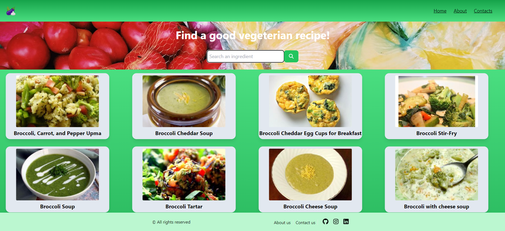

# VeggieFinder

## Technology Used

- HTML
- TailwindCSS
- JavaScript
- React
- Axios
- Vite

## About

This is a project for the React course at start2impact University.
It uses Spoonacular API for results, filtered exclusevly for vegetarian recipes.

## WARNING

The API has a limit use of 150 Points based on Spoonacular DOCS for free users. If the search bar doesn't find any result, there will be an error showed by the website. In this case wait till the next day.

## Try it now

[Link al sito](https://veggiefinder.netlify.app/) (src/Assets/icons8-vegetables-48.png)
